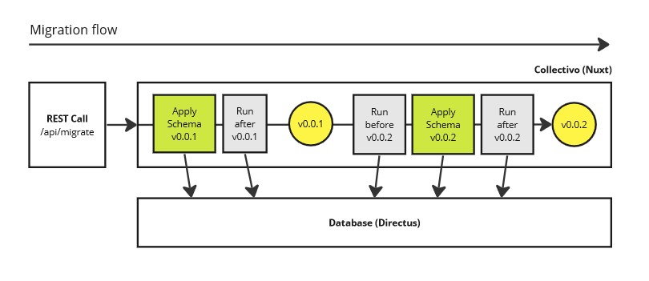

# Developing extensions

## Installation

To set up an development environment, follow the instructions under [local installation](configuration.md#local-installation) to create a local copy or fork of the quickstart repository.
As an IDE, we recommend to use VSCode with the Postman, ESLint, Prettier, Tailwind, and Vue extensions.

## Overview

The repository is structured as follows:

-   `collectivo` - Your custom extension of Collectivo
-   `directus` - Database & data studio
-   `keycloak` - Identity & access management

For more information on the directory structure within `/collectivo`, check out [Nuxt](https://nuxt.com/docs/guide/directory-structure/app).

## Backend

The `collectivo/server/` directory can be used to register your extension, define database schemas, and create API endpoints. For more information, see [Nuxt server/ directory](https://nuxt.com/docs/guide/directory-structure/server).

### Register your extension

To register an extension within Collectivo, use [`registerExtension()`](reference.md#registerextension). Here, you can also add [database schemas](#create-a-database-schema) and [example data](#create-example-data).

```ts title="collectivo/server/plugins/setup.ts"
import pkg from "../../package.json";
import examples from "../examples/examples";
import mySchema from "../schemas/mySchema";

export default defineNitroPlugin(() => {
    registerExtension({
        name: "myExtension",
        description: pkg.description,
        version: pkg.version,
        schemas: [mySchema],
        examples: examples,
    });
});
```

The extension name hast to be unique and will be used by database. It should not include any underscores (`_`) and it is not possible to register to extensions with the same name.

### Understand migrations

Migrations between schemas can be run via the Nuxt API endpoint `/api/migrate/`. Extensions can define a schema for each version. E.g. a schema can be for version `0.0.1` of the core extension `collectivo`. A migration script can be run both before and after applying each schema version.



Migration requests must be authorized with the `COLLECTIVO_API_TOKEN` from `.env`.

The following parameters can be passed:

-   `extension (string)` - Apply migrations of a specific extension. If not given, all extensions will be migrated.
-   `version (string)` - Apply schemas towards specified version. If not given, migration will run up to the latest version.
-   `examples (boolean)` - Create example data (default false).
-   `isolated (boolean)` - Apply only the specified schema (if version is passed) or example data (if no version passed).

Here is an example to prepare a new system for local development (the same code is run by `pnpm seed`):

```sh
curl --header "Authorization: badToken" --request POST "http://localhost:3000/api/migrate/?examples=true"
```

This cURL command can also be imported with an HTTP client like the VSCode [Postman](https://www.postman.com/) extension.

### Create a database schema

An extension can define collections and fields for the database.

Create a new schema file in `collectivo/server/schemas` and use [`initschema()`](reference.md#initschema) to create a new [`ExtensionSchema`](reference.md#extensionschema). Set the name and version for your schema to the name and current version of your extension in `package.json`.

```ts title="collectivo/server/schemas/mySchema.ts"
const schema = initSchema("myExtension", "0.0.1");

schema.collections = [
    {
        collection: "example_collection",
        schema: { name: "example_collection" },
    },
];

schema.fields = [
    {
        collection: "example_collection",
        field: "example_field",
        type: "string",
        schema: {},
        meta: {},
    },
];
```

Notes:

-   The types for the schema follow the [Directus SDK](https://docs.directus.io/reference/system/collections.html)
-   Database collections and fields should start with the name of the extension followed by an underscore to avoid name conflicts with other extensions. E.g. `myExtension_myCollection` and `myExtension_myField`.
-   You can also add fields to collections that are not part of your extensions, like `directus_users`.

### Create example data

This function can be used to create example data for your extension:

```ts title="collectivo/server/examples/examples.ts"
import { createItem, deleteItems } from "@directus/sdk";

export default async function examples() {
    const directus = await useDirectusAdmin();

    await directus.request(deleteItems("example_collection", { limit: 1000 }));

    await directus.request(
        createItem("example_collection", {
            example_field: "example_value",
        }),
    );
}
```

### Create hooks

A hook is an automated workflow that can be used to trigger a Nuxt endpoint when a certain database event occures.

To set up a hook, add a directus flow trigger to your schema:

```ts title="collectivo/server/schemas/my_schema.ts"
const schema = initSchema("example", "0.0.1");
schema.createNuxtHook(
    {
        name: "example_flow",
        status: "active",
        accountability: "all",
        trigger: "event",
        options: {
            type: "action",
            scope: ["items.update"],
            collections: ["example_collection"],
        },
    },
    "api/example",
);
```

The following flow will call the `api/example` script whenever an item in the `example_collection` is updated.

For more information on directus flows, see [Directus Flows](https://docs.directus.io/reference/system/flows.html).

Then, create a correspondig Nuxt endpoint:

```ts title="collectivo/server/api/example.post.s"
export default defineEventHandler(async (event) => {
    // Protect this route with the .env variable COLLECTIVO_API_TOKEN
    verifyCollectivoApiToken(event);
    // Run your script here
});
```

For more information on nuxt endpoints, see [Nuxt API](https://nuxt.com/docs/guide/directory-structure/server).

If Directus cannot reach Nuxt in development mode, make sure that the Nuxt dev server is called with `dev --host`.

## Frontend

### Adjust the theme

Collectivo uses [`tailwindcss`](https://tailwindcss.com/) and [`nuxt-ui`](https://ui.nuxt.com/) for styling and components. The theme can be adapted in `tailwind.config.ts` and `app.config.ts`. The main layout can be overwritten by creating a file `collectivo/layouts/default` (see [Nuxt layouts](https://nuxt.com/docs/guide/directory-structure/layouts)).

### Use icons

Collectivo uses [`UIcon`](https://ui.nuxt.com/getting-started/theming#icons) and [`Iconify`](https://iconify.design/) to load icons. They have to be defined as `i-{collection_name}-{icon_name}`. By default, Collectivo uses the [HeroIcons](https://icones.js.org/collection/heroicons) library. Additional libraries can be defined in [`nuxt.config.ts`](https://ui.nuxt.com/getting-started/theming#icons).

### Add a page

You can add custom pages in `collectivo/pages/`. It is recommended to use a namespace for your extension, such as `collectivo/pages/myextension/mypage`. This page will then be reachable under `http://localhost:3000/myextension/mypage`. For more information, see [Nuxt pages](https://nuxt.com/docs/guide/directory-structure/pages).

To only allow authenticated users on a page, add the following middleware to the setup script. If Keycloak is used, this will forward people directly to Keycloak, using Directus' [Seamless SSO](https://docs.directus.io/self-hosted/sso.html#seamless-sso) feature.

```ts title="collectivo/pages/myextension/mypage"
definePageMeta({
    middleware: ["auth"],
});
```

To change the title on your page, use [`setCollectivoTitle()`](reference.md#setcollectivotitle):

```ts title="collectivo/pages/myextension/mypage"
setCollectivoTitle("Dashboard");
```

### Add a menu item

Use [`useCollectivoMenus()`](reference.md#usecollectivomenus) to add menu items. Use a [Nuxt plugin] to register the menu item when the app is initialized.

```ts title="my-extension/plugins/setup.ts"
export default defineNuxtPlugin(() => {
  const menu = useCollectivoMenus();
  menu.value.main.push({
    label: "My menu item",
    icon: "i-heroicons-star",
    to: "/myextension/mypage",
    order: 100
  });
}
```

There are two menus by default:

-   `main`: Shown for authenticated users.
-   `public`: Shown for unauthenticated users.

### Create a dashboard tile

Tiles are defined in the database collection `collectivo_tiles`. If you want your tile to just display text, you can simply create a new dashboard tile in the database. You can also create dynamic components that can be displayed inside a dashboard tile. To do so, create a new component file `components/global/`. Then, add a new dashboard tile to your database and set the field `Component` to the name of your tile.

## Further topics

### Add database types

To add types of your database schema to the directus client, corresponding to your [database schema](#create-a-database-schema) on the backend:

```ts title="collectivo/index.d.ts"
declare global {
    interface CollectivoSchema {
        example_collection: ExampleCollection[];
    }

    interface ExampleCollection {
        id: number;
        example_field: string;
    }
}

export {};
```

You can then enjoy type checking when using directus:

```ts
const directus = useDirectus();
const data = await directus.request(readItems("example_collection"));
```

Typescript will then know that data is a `ExampleCollection[]` and that `data[0].example_field` is a string.

### Publish your extension as a package

You can share your custom functionality with others by creating an extension of Collectivo as an npm package. The code within `/collectivo` will then be packaged as a [Layer](https://nuxt.com/docs/getting-started/layers) that can be installed as an extension by other users of Collectivo.

To do so, configure the name, version, author, and license in [`collectivo/package.json`](https://docs.npmjs.com/cli/v6/configuring-npm/package-json) and set `private:false`.

It is recommended to start the package name with `collectivo-` to make it easier to find by others users of Collectivo, e.g.: `collectivo-my-extension`.

Then, publish your extension on npm.

```sh
pnpm publish -r --access=public
```

### Format your code

Run the following commands to ensure a consistent style in your code.
You can install the Prettier and ESLint extensions in VSCode to do this automatically.

-   To run linting checks, use: `pnpm lint`
-   To apply linting to all files, use: `pnpm lint:fix`
-   To run formatting checks, use: `pnpm format`
-   To apply formatting to all files, use: `pnpm format:fix`
