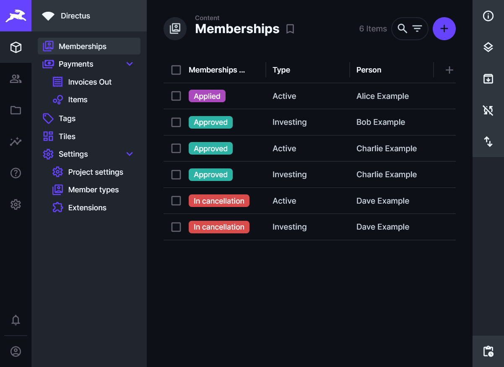

# Collectivo Documentation

## A modular platform for your community

Collectivo is an open-source framework for buildig community platforms. It allows you to create a digital space, where users can interact with each other and organize together. Thanks to its modular design, the platform is completely flexible and can include [many different features](#features). Good software for all! :)

## Get in touch

If you are interested in using Collectivo or contributing to its development, please join the conversation on our [Discord server](https://discord.gg/42MWureAYW), subscribe to our [Newsletter](https://mailchi.mp/79143ea8bd3c/collectivo), or write to [info@collectivo.io](mailto:info@collectivo.io).

## Technical overview

Collectivo consists of three key applications:

-   **Community app**: The heart of Collectivo, a digital plattform for your community - built with [Nuxt](https://nuxt.com/). It is easy to customize and extend, multilingual, and mobile-friendly.

-   **Data studio**: Collectivo uses [Directus](https://directus.io/) on the backend. This offers you a modern data studio to manage content, create visualizations, track changes, and automate workflows.

-   **Single sign-on**: Collectivo uses [Keycloak](https://www.keycloak.org/) for identity and access management. This makes it possible for users to have only one account for multiple applications.

## Screenshots

{ width="49%" }
{ width="49%" }

## Features

-   **Dashboard**: Add dynamic tiles to the landing page of your platform.
-   **Messages**: Create templates, send email campaigns, and schedule automated notifications to communicate with your users.
-   **Memberships**: Create custom application forms, manage memberships, and let members manage their own data.
-   **Payments**: Create and manage invoices.
-   **Your own ideas?** Start [creating your own custom features](development.md) or [get in touch](#get-in-touch).

Currently under construction:

-   **Shifts**: Coordinate working shifts within your community.
-   **Organizational structures**: Represent working groups and roles of your organizations.
-   **Decision-making**: Use the plattform for voting and collective decision-making processes.

## Documentation structure

The rest of this documentation is structured as follows:

-   [**Installation & configuration**](configuration.md): This guide is for administrators who want to install, configure, and publish a Collectivo platform for their community.
-   [**Extension development**](development.md): This guide is for developers who want to create custom extensions for the Collectivo platform.
-   [**API Reference**](reference.md): Detailed technical documention.

## About

Collectivo is a collaboration of
the Austrian cooperative [MILA Mitmach-Supermarkt](https://mila.wien/) and the IT collective
[convive\*](http://convive.io/). It has received funding from
[AK Wien Digifonds](https://wien.arbeiterkammer.at/digifonds) and [Wirtschaftsagentur Wien](https://wirtschaftsagentur.at/).

[{ width="30%" }](https://wien.arbeiterkammer.at/digifonds)
[{ width="30%" }](https://wirtschaftsagentur.at/)
